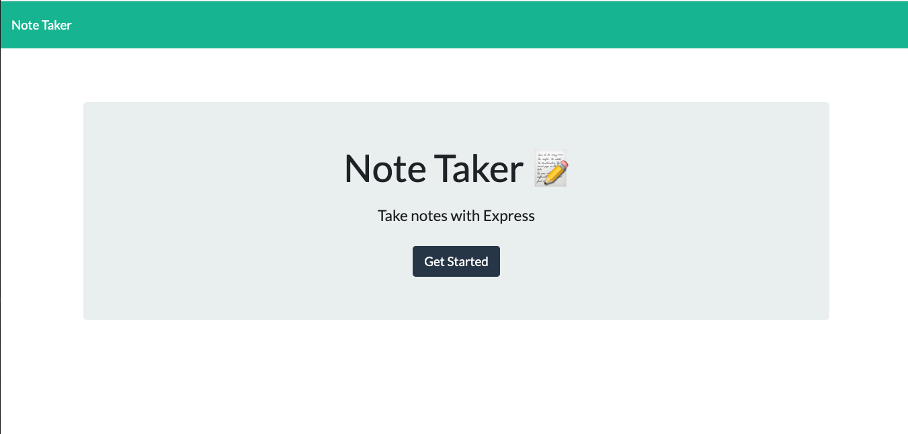
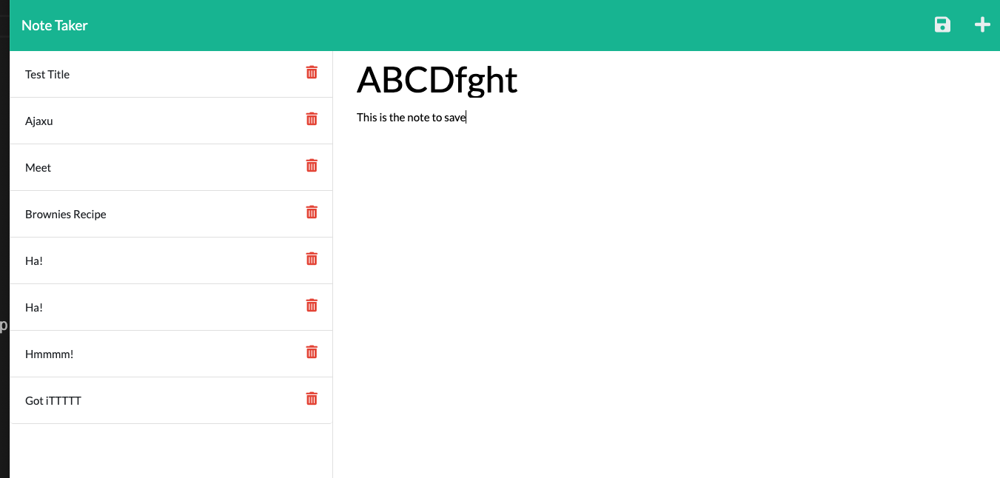
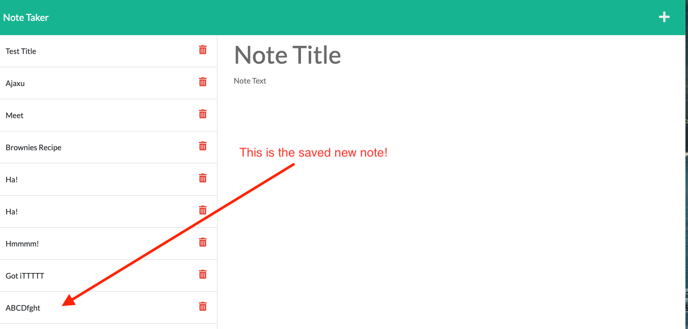

# note_tkr
  ### By likica * [Email me](mailto:fahrija_wyroski@live.com) * 
  * [Deployed Appplication In Progress](https://likicanotetkr.herokuapp.com/)
 
  ## Table of contents
  * [Description](#Description)
  * [Installation Instructions](#installation-Instructions)
  * [Usage Instructions](#Usage-Instructions)
  * [Questions](#Questions)
  * [Contributing](#Contributing)
  * [Tests](#Tests)
 
  # Description
  ##### [Back to Table of Contents](#Table-of-Contents)
  Create, save and view your Notes with Note Tkr!

  ## User Story
  ##### [Back to Table of Contents](#Table-of-Contents)
  AS A small business owner I WANT to be able to write and save notes SO THAT I can organize my thoughts and keep track of tasks I need to complete

  ## Installation Instructions
  ##### [Back to Table of Contents](#Table-of-Contents)
  Use URl to use Note Tkr

  ## Usage Instructions
  ##### [Back to Table of Contents](#Table-of-Contents)
* Open URL, add your note, view your note and add another note if you want

<h3 align="center" width="100%">
  NoteTkr Landing Page 

    
     <h3 align="center" width="100%">
  NoteTkr Enter New Note 

    
     <h3 align="center" width="100%">
  NoteTkr Save Note 

    

  ## Contributing
  ##### [Back to Table of Contents](#Table-of-Contents)
  All allowed to contribute

  ## Tests
  #### [Back to Table of Contents](#Table-of-Contents)
  1. Tested routes on local server
  2. Launched to Heroku

  ## Questions
  ##### [Back to Table of Contents](#Table-of-Contents)
  * If you have any questions, please contact me at 
  [Email me](mailto:fahrija_wyroski@live.com)

  ## License 
  * License Type: MIT
    
    [License: MIT](https://opensource.org/licenses/MIT)
    Permission is hereby granted, free of charge, to any person obtaining a copy of this software and associated documentation files (the "Software"), to deal in the Software without restriction, including without limitation the rights to use, copy, modify, merge, publish, distribute, sublicense, and/or sell copies of the Software, and to permit persons to whom the Software is furnished to do so, subject to the following conditions:The above copyright notice and this permission notice shall be included in all copies or substantial portions of the Software.THE SOFTWARE IS PROVIDED "AS IS", WITHOUT WARRANTY OF ANY KIND, EXPRESS OR IMPLIED, INCLUDING BUT NOT LIMITED TO THE WARRANTIES OF MERCHANTABILITY, FITNESS FOR A PARTICULAR PURPOSE AND NONINFRINGEMENT. IN NO EVENT SHALL THE AUTHORS OR COPYRIGHT HOLDERS BE LIABLE FOR ANY CLAIM, DAMAGES OR OTHER LIABILITY, WHETHER IN AN ACTION OF CONTRACT, TORT OR OTHERWISE, ARISING FROM, OUT OF OR IN CONNECTION WITH THE SOFTWARE OR THE USE OR OTHER DEALINGS IN THE SOFTWARE.

  _This README was generated by Likica with_ ❤️ [My GitHub Profile](https://github.com/likica)
 
  